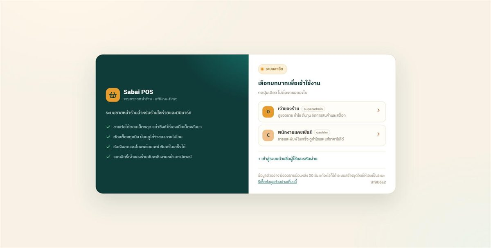
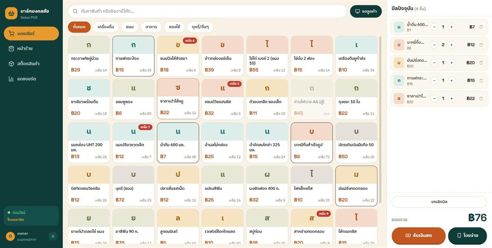
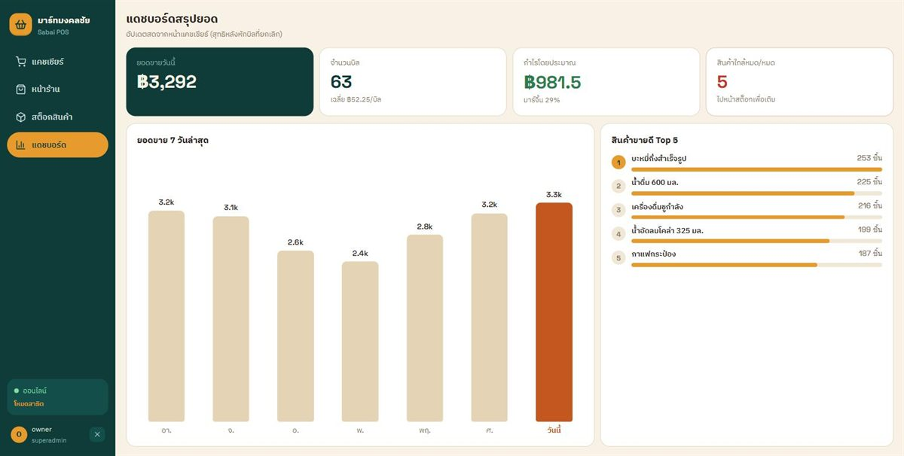

# Sabai POS 🛒

**ระบบขายหน้าร้านสำหรับร้านโชห่วยและมินิมาร์ท — ขายต่อได้แม้เน็ตหลุด**

Go · PostgreSQL · React (PWA) · Docker · Azure Container Apps

[](https://github.com/PLXXM29/sabai-pos/actions/workflows/ci.yml)
[](https://github.com/PLXXM29/sabai-pos/actions/workflows/deploy.yml)

### ▶︎ [ลองใช้เดโม](https://sabai-pos.graysand-7cd63bec.southeastasia.azurecontainerapps.io)

เปิดแล้วกดปุ่มเดียวเข้าได้เลย ไม่ต้องสมัคร — เลือกได้ 2 บทบาท
(`owner` / `cashier`, รหัสคือ `[บทบาท]1234`) ลองเข้าเป็น `cashier`
แล้วเปิด `/dashboard` ดูได้ว่าเซิร์ฟเวอร์ปฏิเสธจริง
ข้อมูลเป็นชุดตัวอย่างที่สร้างขึ้น มียอดขายย้อนหลัง 30 วัน และรีเซ็ตอัตโนมัติทุกวัน
**แก้ ลบ ขาย ยกเลิกบิลได้ตามสบาย** มีปุ่มรีเซ็ตอยู่ที่หน้าล็อกอิน



---

## โจทย์

ร้านโชห่วยแถวบ้านใช้เครื่องคิดเลขกับสมุด ปัญหาไม่ใช่ว่าไม่มีซอฟต์แวร์ POS ให้ใช้
แต่คือ POS ที่มีอยู่ **หยุดทำงานเมื่อเน็ตหลุด** ซึ่งสำหรับร้านที่ใช้เน็ตมือถือคือเรื่องปกติรายวัน
พอขายต่อไม่ได้ก็ต้องจดใส่กระดาษ แล้วสิ้นวันยอดก็ไม่ตรงกับของบนชั้น

ระบบนี้จึงออกแบบโดยถือว่า **"ออฟไลน์คือสถานะปกติ ไม่ใช่ข้อผิดพลาด"**

| | |
|---|---|
| **ขายตอนเน็ตหลุด** | บิลถูกเขียนลง IndexedDB ก่อนเสมอ แล้วซิงก์ทีหลัง โดยใช้ `client_uuid` เป็น idempotency key ยิงซ้ำกี่ครั้งก็ได้บิลเดียว |
| **สต็อกตรวจสอบได้** | ยอดคงเหลือไม่ได้เก็บเป็นตัวเลขลอย ๆ แต่คำนวณจาก ledger แบบ append-only ที่มี trigger กัน UPDATE/DELETE ระดับฐานข้อมูล |
| **เงินไม่มีเศษหาย** | เก็บเป็น integer สตางค์ทั้งระบบ ไม่มี float แม้แต่จุดเดียว → [ADR 0001](docs/adr/0001-money-representation.md) |
| **บิลแก้ไม่ได้** | ยกเลิกบิล = ออกบิล void ใบใหม่ที่อ้างถึงใบเดิมและคืนสต็อกผ่าน ledger ของเดิมยังอยู่ครบ |
| **สิทธิ์จริง ไม่ใช่ซ่อนปุ่ม** | RBAC ตรวจที่เซิร์ฟเวอร์ — ลองล็อกอินเป็น `cashier` แล้วยิง `/api/v1/reports/summary` จะได้ 403 |
| **รับเงินโอน** | สร้าง QR พร้อมเพย์ตามมาตรฐาน EMVCo ในเครื่อง (ออฟไลน์ได้) และตรวจเงินเข้าอัตโนมัติผ่าน LINE webhook ได้ → [docs/payments.md](docs/payments.md) |




## สถาปัตยกรรม

```
                    ┌─────────────────────────────────────────┐
   เบราว์เซอร์ /     │  Azure Container Apps (scale-to-zero)   │
   PWA บนมือถือ ───▶ │  ┌───────────────────────────────────┐  │
                    │  │  sabai-pos  (Go, distroless 56MB) │  │
                    │  │                                   │  │
                    │  │  /            → SPA ที่ฝังในไบนารี │  │
                    │  │  /api/v1/…    → REST + JWT/RBAC    │  │
                    │  │  boot         → migrate + seed     │  │
                    │  └───────────────┬───────────────────┘  │
                    └──────────────────┼──────────────────────┘
                                       ▼
                              Neon Postgres (serverless)
```

**ทั้งระบบคือคอนเทนเนอร์เดียว** — Go binary เสิร์ฟทั้งหน้าเว็บและ API
ไม่ใช่เพราะขี้เกียจแยก แต่เพราะ refresh token เป็น httpOnly cookie
ถ้าแยก origin จะต้องใช้ `SameSite=None` (ซึ่ง Safari บล็อก) บวกกับ CORS allow-list ที่ต้องคอยดูแล
อยู่ origin เดียวกันปัญหาทั้งสองหายไป และเหลือของให้ deploy แค่ชิ้นเดียว
เหตุผลเต็มอยู่ใน [`backend/internal/web`](backend/internal/web/web.go)

```
sabai-pos/
├── backend/            Go 1.25 · Gin · PostgreSQL 16 · sqlc · JWT · Zap
│   ├── cmd/api/            entrypoint: config → db → migrate → seed → http
│   ├── cmd/seed/           ติดตั้งครั้งแรกสำหรับร้านจริง
│   ├── internal/
│   │   ├── demo/           สร้างชุดข้อมูลตัวอย่าง 1 เดือนแบบ deterministic
│   │   ├── web/            เสิร์ฟ SPA ที่ฝังไว้ (cache + gzip + SPA fallback)
│   │   ├── dbmigrate/      รัน migration ตอนบูต (advisory lock กันชนกัน)
│   │   ├── service/        business logic (ขาย/สต็อก/รายงาน/ชำระเงิน)
│   │   ├── store/          sqlc generated — query ที่ type-safe
│   │   └── …               auth · middleware · handler · receipt · domain
│   └── migrations/         golang-migrate (ฝังในไบนารีด้วย embed.FS)
├── frontend/           Vite + React + TS · Dexie (IndexedDB) · PWA
├── docs/               ADR · deploy · payments · handover
└── Dockerfile          3 stage → distroless non-root image เดียว
```

## รันในเครื่อง

ต้องมี **Docker Desktop** ทำงานอยู่ แค่นี้พอ

```bash
cp .env.example .env
docker compose up -d --build
```

เปิด **http://localhost:8082** ได้เลย — schema ถูก migrate และข้อมูลตัวอย่าง
(สินค้า 36 รายการ + บิลย้อนหลัง 30 วัน ~1,500 ใบ) ถูกสร้างให้อัตโนมัติในการบูตครั้งแรก

<details>
<summary>แก้โค้ดฝั่งหน้าเว็บ (มี HMR)</summary>

```bash
cd frontend && npm install && npm run dev     # http://localhost:5173
```

Vite proxy `/api` ไปที่ `:8082` ให้แล้ว จึงยังเป็น same-origin เหมือนตอน production
</details>

<details>
<summary>รันเฉพาะ backend (ไม่ผ่าน compose)</summary>

```bash
cd backend
cp .env.example .env          # ชี้ DATABASE_URL ไปที่ Postgres ที่รันอยู่
make ui                       # (ครั้งแรก) build หน้าเว็บเข้าไปฝังในไบนารี
make run
```
</details>

### เทสต์

```bash
cd backend
make test        # unit — เร็ว ไม่ต้องใช้ Docker
make test-all    # + integration ยิงใส่ Postgres จริงผ่าน testcontainers
```

## API

| Method | Path | สิทธิ์ |
|---|---|---|
| GET | `/api/v1/meta` | public — บอกว่า deployment นี้เป็นเดโมหรือไม่ |
| POST | `/api/v1/auth/login` · `/refresh` · `/logout` | public (refresh ใช้ httpOnly cookie + rotation) |
| GET/POST | `/api/v1/auth/me` · `/change-password` | auth |
| POST | `/api/v1/auth/register` | manager+ |
| GET | `/api/v1/products` · `/:id` · `/:id/onhand` | auth (รวม cashier) |
| POST/PUT/DELETE | `/api/v1/products` … · `/:id/receive` | **manager+** (cashier ได้ 403) |
| POST | `/api/v1/bills` | auth · atomic · idempotent ด้วย `client_uuid` |
| GET | `/api/v1/bills/:id/receipt?format=html\|escpos&width=58\|80` | auth |
| POST | `/api/v1/bills/:id/void` | **manager+** |
| POST/GET | `/api/v1/payments` · `/:id` · `/:id/cancel` | auth |
| POST | `/api/v1/webhooks/line` · `/webhooks/payment` | ตรวจลายเซ็น LINE / `X-Notify-Secret` |
| POST | `/api/v1/demo/reset` | เฉพาะตอน `DEMO_MODE=true` เท่านั้น |
| GET | `/healthz` · `/readyz` | public |

## Deploy

| ปลายทาง | วิธี |
|---|---|
| **Azure Container Apps** (เดโมตัวนี้) | push เข้า `main` → GitHub Actions build image → push ghcr.io → `az containerapp update` → เช็ก `/readyz` ก่อนถือว่าสำเร็จ · auth เป็น OIDC ไม่มี secret ค้างในรีโป |
| **เซิร์ฟเวอร์ตัวเอง** | `docker compose -f docker-compose.prod.yml up -d --build` + Caddy ข้างหน้าเพื่อทำ HTTPS |

ขั้นตอนเต็ม ตัวแปรทั้งหมด และการสำรองข้อมูล: [docs/deploy.md](docs/deploy.md)
· ส่งมอบ/ดูแลระบบ: [docs/handover.md](docs/handover.md)

## หลักการที่ยึด (ห้ามพลาด)

- **เงิน = integer สตางค์** (1 บาท = 100 สตางค์) ไม่มี float ทั้งระบบ → [ADR 0001](docs/adr/0001-money-representation.md)
- **สต็อก = ledger แบบ append-only** (`stock_movements`) แก้/ลบไม่ได้ มี trigger กันที่ฐานข้อมูล
- **บิล immutable** + snapshot ชื่อและราคาตอนขาย · `client_uuid` คือ idempotency key ของการซิงก์
- **เลขบิลไม่มีช่องว่าง** — จองเลขในทรานแซกชันเดียวกับการขาย rollback แล้วเลขคืนอัตโนมัติ
- **ทุกตารางมี `store_id`** (พร้อมขยายเป็น multi-tenant) → [ADR 0002](docs/adr/0002-architecture-and-stack.md)
